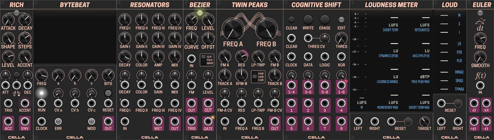

# Cella Modules Collection for VCV Rack

[Full Manual](/docs/Cella_Manual.md)

## Modules Overview

### Resonators
**Resonators** is a module that features four pitched resonators based on the Karplus-Strong algorithm. It is designed to create rich, resonant sounds by simulating the behavior of plucked strings or other resonant bodies. Functionality is inspired by audio effect of the same name found in popular DAW.

[YOUTUBE: Cella - Resonators DEMO](https://www.youtube.com/watch?v=gn_RQxh0R7A)

[**Resonators demo by Omri Cohen (YouTube)**](https://www.youtube.com/watch?v=IwO37pXGd5A)

### Twin Peaks
**Twin Peaks** is a dual resonant filter inspired by the design of Rob Hordijk's TwinPeak filter and Klangbauköln's Twin Peak Resonator. The design is straightforward: the same input signal is passed through two resonant low-pass filters, A and B, and their outputs are subtracted, producing a band-pass response with two peaks. This design allows the filters to 'pass' each other, meaning it doesn't matter which filter has the lower or higher cutoff frequency — the signal still passes through.

While you can use this module for filtering sound sources, it is best suited for being pinged with a stepped signal at relatively high resonance, which produces pleasant percussive sounds. The module offers a few internal modulation options, such as frequency modulation using the incoming signal and cross-modulation of filter A's frequency by the output of filter B. There are also multiple inputs that support external signal modulation.

Under the hood, the module uses the DSP core from Audible Instruments' Liquid Filter but adds the option to use an 18dB 3-pole filter output, which was used by Rob Hordijk in his TwinPeak filter.

[YOUTUBE: Cella - Twink Peaks DEMO](https://www.youtube.com/watch?v=5Igmv7xRjQA)

### Rich
**Rich** is an expressive AD envelope generator with stepped or modulated accent. **Step** parameter specifies how many increments accent will have if it is triggered continuously. Positive number of steps will provide expected accent, while negative value will make an inverted accent that subtracts from baseline level. Most importantly, **Accent** input accepts not only triggers, but any CV signal between 0V and 10V, and further modulates accent level, allowing for any desired accent pattern. Stepped accent can be rising or falling, which is controlled by the button at the center of module or respective input below it.

[YOUTUBE: Cella - Rich DEMO](https://www.youtube.com/watch?v=p8z6d3rFdyQ)

### Bezier
**Bezier** is a smooth random voltage generator based on Bezier curves. Heavily inspired by module ADDAC507, which ADDAC designed in collaboration with Rijnder Kamerbeek aka Monotrail. Module consists of one curve generator with adjustable slope - from rounded to spiky. New random value is sampled at set frequency, and module extrapolates to it from current value following curve of desired properties. Module can also sample external signal, thus working as a sort of slew limiter.

### Cognitive Shift

**Cognitive Shift** is an advanced 8-bit digital shift register module for VCV Rack. It goes beyond basic shift register functionality by incorporating flexible input logic (including XOR and selectable logic operations), manual data overrides, three overlapping unipolar DAC outputs, a bipolar 8-bit DAC output, and configurable gate output modes. It also features intelligent self-patching detection to facilitate complex feedback patterns.

Main differentiator from other implementations is the ability to output triggers or gates per each step without merging consecutive gates together, and yet allow for self-patching.

### Loudness Meter

**Loudness Meter** and its narrow version **Loudness** are a comprehensive audio loudness meters based on the EBU R128 standard, utilizing the [libebur128](https://github.com/jiixyj/libebur128) library for accurate measurements.

### Euler
**Euler** calculates rate of change of any signal. It finds angle *theta* of a slope of incoming signal, normalises it by 90 degrees and scales to -10..10V. *Frequency* parameter is required to adjust calculation sensitivity, while parameter *Smooth* removes irregularities from the input. There are four outputs: theta, absolute value of theta, positive component of theta and negative component of theta.
Suggested use: connect controller such as fader to Euler. The faster you move the fader, the higher a peak out of Euler will be before it subsides.

### Byte
**Byte** is a bytebeat evaluator that allows users to create complex audio signals using bytebeat expressions. The module features several parameters and inputs to modulate the bytebeat expressions in real-time. It also supports various bit-depth of the output.
