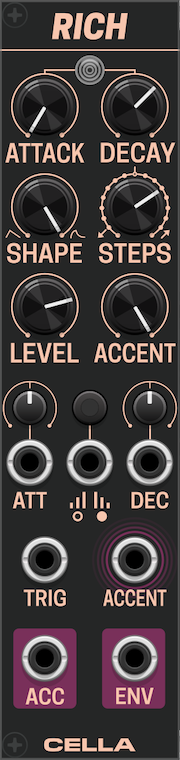
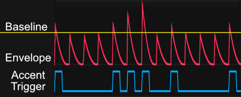
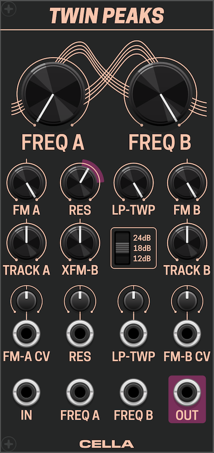
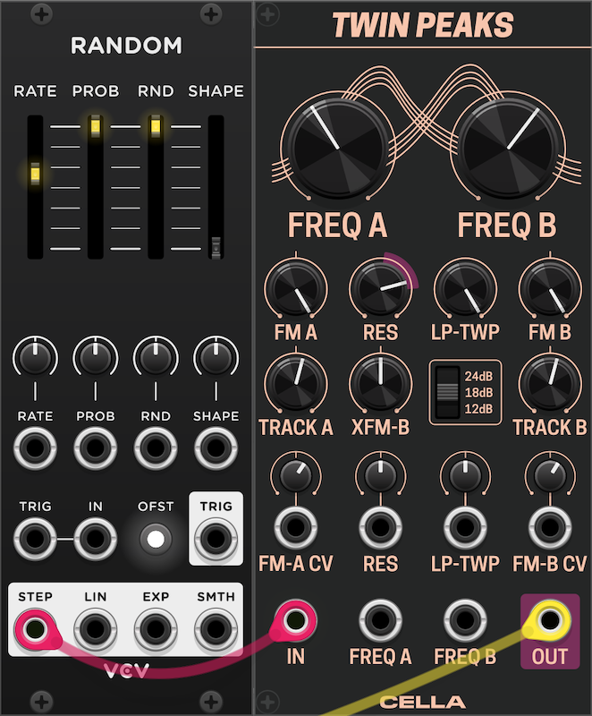
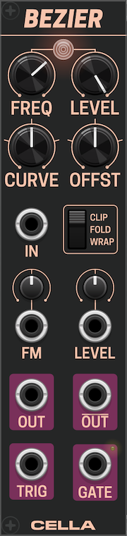
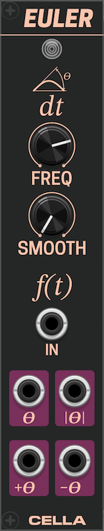
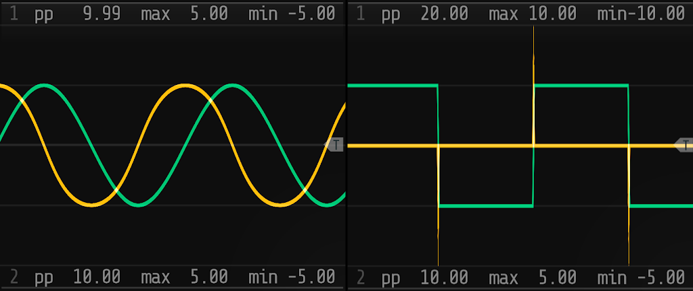
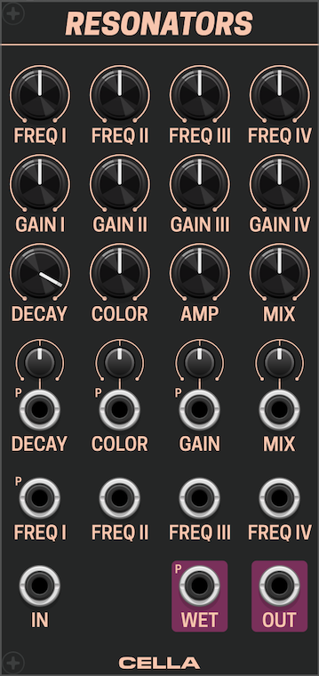

# Cella – User Manual

# Version 2.0.5

# **LICENSE**

Source code for this plugin can be found on GitHub: [https://github.com/victorkashirin/CellaVCV](https://github.com/victorkashirin/CellaVCV)

Code is licensed under GPL v3.0.

All graphics are copyright 2024 Victor Kashirin and licensed under CC BY-SA 4.0.

# **Rich**

[**Rich Demo (YouTube)**](https://www.youtube.com/watch?v=p8z6d3rFdyQ)

**Rich** is an expressive AD envelope generator with stepped or modulated accents. It allows for generating natural-sounding envelopes with varying dynamics. Successive accents can incrementally increase or decrease the total amplitude of an envelope, or it can be set to an arbitrary amplitude proportional to the signal at the ACCENT input.

Adding an accent to the envelope means that the peak point of the envelope will differ (higher or lower) from when no accent is applied. A stepped accent means the accent level is dynamic, moving step by step from minimum to maximum (or vice versa) with each consecutive combination of envelope and accent triggers. See image below for visual explanation of that effect.

#### **Key features / controls**

* **ATTACK** and **DECAY** set the rise and fall times of the envelope, ranging from 1ms to 10s.
* **SHAPE** interpolates between a linear and an exponential envelope.
* **STEPS** specify the number of increments (or decrements) in accent amplitude with each consecutive accent trigger. At noon, no accents will be added (0 steps). At 1, there will be only one amplitude of 100%; at 2, the amplitudes will be 50% and 100%, and so on. Negative values create an inverted accent that subtracts from the baseline level.
* **LEVEL** sets the baseline amplitude of the envelope (0%–100%, corresponding to 0V–10V).
* **ACCENT** sets the maximum amplitude of the accent added to the baseline. Note that this amplitude is applied to the remaining amplitude headroom after the baseline is set. For example, if the baseline amplitude is set to 60% (peaking at 6V), an ACCENT level of 100% will add up to 4V of additional peak amplitude. With an ACCENT level of 50%, the maximum accent amplitude will be 2V, and the peak envelope will be at 8V (BASELINE \+ ACCENT).

#### **Inputs**

* **Ascending/Descending button/input** in the center of the module sets the direction of change for the stepped accent: either from the lowest to highest level or vice versa.
* **TRIG** accepts triggers and activates the envelope.
* **ACCENT** accepts triggers, gates, and any CV signal between 0V and 10V. A high input at the ACCENT tells the module to generate an accent, and the incoming signal modulates the accent level, allowing for any desired accent pattern.
* **ATT** and **DEC** allow modulation of Attack and Decay.

#### **Outputs**

* **ACC** outputs the current accent level. Note that this output is not scaled by the ACCENT knob, allowing external signal modulation while the ACCENT knob is set to zero.
* **ENV** outputs the resulting envelope.

A unique feature of the Rich module is its tolerance for delay between the signal and accent triggers. In most modules, even a delay of 1 sample between the envelope trigger and accent trigger results in a missed accent. Such delays can occur if the number of cables between the clock source and trigger inputs differs, as each cable delays the signal by one sample. By default, Rich captures an accent trigger even if it occurs 5 samples before or after the envelope trigger. This window can be increased to ±10 samples or switched off in the context menu.

#### **Context Menu Options**

* **Attack Curve:** Choose between Logarithmic or Exponential curves for the attack section of the envelope.
* **Exponent Function:** Choose between quadratic, cubic, and quartic functions for snappier envelopes.
* **Retrigger:** Toggle retriggering on or off.
* **Retrigger Strategy:** Due to the accents, peak values can differ from one hit to another, posing a challenge for retriggering. In traditional envelopes, retriggering forces the envelope to start rising from its current point of decay toward the next envelope’s peak. With a long decay, the envelope may be at a higher point than the peak of the next envelope during retriggering. Two strategies apply here: (I) Jump down to the next envelope's peak and start immediately from the decay stage. Care is taken to prevent clicks or thumps caused by rapid amplitude changes. (II) Don't retrigger until the next envelope's peak is higher than the current envelope point, creating interesting rhythmic effects.
* **Trigger Sync Delay:** Sets the window for capturing trigger and accent signals.

# **Twin Peaks**

[Twink Peaks DEMO (YouTube)](https://www.youtube.com/watch?v=5Igmv7xRjQA)

**Twin Peaks** is a dual resonant filter inspired by the design of Rob Hordijk's TwinPeak filter and Klangbauköln's Twin Peak Resonator.

The design is straightforward: the same input signal is passed through two resonant low-pass filters, A and B, and their outputs are subtracted, producing a band-pass response with two peaks. This design allows the filters to 'pass' each other, meaning it doesn't matter which filter has the lower or higher cutoff frequency — the signal still passes through.

While you can use this module for filtering sound sources, it is best suited for being pinged with a stepped signal at relatively high resonance, which produces pleasant percussive sounds. The module offers a few internal modulation options, such as frequency modulation using the incoming signal and cross-modulation of filter A's frequency by the output of filter B. There are also multiple inputs that support external signal modulation.

Under the hood, the module uses the DSP core from Audible Instruments' Liquid Filter but adds the option to use an 18dB 3-pole filter output, which was used by Rob Hordijk in his TwinPeak filter.

#### **Controls**

Here we’ll explain only non-obvious parameters:

* **FM A** and **FM B** control the total amount of modulation applied to the frequencies of respective filters. It can be useful to attenuate the sum of all modulation signals or to invert modulation.
* **RES** controls resonance for both filters. Pink band highlights range most suitable for pinging.
* **LP-TWP** allows interpolation between low-pass and band-pass modes. At 0% only output from low-pass filter A is sent to the output, while at 100% band-pass mode if fully on.
* **TRACK A** and **TRACK B** control how much of the input signal is sent to modulate cut-off frequency of the respective filter.
* **XFM-B**  controls how much of the output from filter B is sent to modulate cut-off frequency of filter A.
* Input to **FM-A CV** is normalled to input **FM-B CV**, so you can use one cable to modulate both filters.

#### **Basic Use**

Send any stepped output to the input – for example, from VCV’s random module where **SHAPE** is set to 0%, **OFST** is on and **RATE** is set to 9 Hz. Set resonance **RES** to 75%, **FREQ A** to 300 Hz and **FREQ B** to 1500 Hz, **TRACK A** and **TRACK B** to 10%.

# **Bezier**

Bezier is a smooth random voltage generator that uses Bezier curves for interpolation between consecutive values. These curves allow the generation of lines with various characteristics, from smooth to spiky, using a limited set of parameters. The functionality is heavily inspired by the module *Random Bezier Waves* / *ADDAC507*, which **ADDAC** designed in collaboration with Rijnder Kamerbeek aka **Monotrail**.

#### **General Algorithm**

1. **Random Value Generation**: At a frequency defined by the **FREQ** parameter, a new random value between \-5V and 5V is generated. Each time this value is generated, a trigger signal is sent to the **TRIG** port. By default, the random value is drawn from a uniform distribution, meaning there is no bias in the distribution of the values. Alternatively, it can be drawn from a normal distribution, which tends to generate values closer to the midpoint rather than the extremes. This behavior can be adjusted via the context menu.
2. **Interpolation**: The module interpolates between the previous value and the newly generated one according to the curve parameterized by the **CURVE** knob. When the knob is set to the 12 o'clock position, the interpolation is linear. Turning it fully clockwise results in a rounded curve, while turning it fully counterclockwise produces a spiked shape. The result of the interpolation is output through the **OUT** port, while an inverted signal (relative to the **OFFSET**) is sent to the **OUT–** port. Additionally, the **GATE** output continuously sends a signal equal to the maximum value between 0 and the generated curve.
3. **Repetition**: The interpolation completes by the time the next random value is generated, and the process repeats from step 1\.

Additional Details:

* The output signal is always constrained to the \-5V to 5V range.
* The generated signal can be scaled using the **LEVEL** knob, which attenuates the signal from 0% to 100%.
* The frequency cannot be synchronized with the outside clock.

#### **Modulation**

Both the frequency and level can be modulated with an external signal. By default, modulation is sampled and applied only when a new random value is generated. However, this behavior can be modified via context menu switches, allowing continuous modulation of frequency and/or level.

Frequency modulation is unrestricted, while level modulation, when applied externally, is typically clipped to the 0% to 100% range. This clipping behavior can also be adjusted in the context menu.

#### **Clipping**

Since the output is limited to the \-5V to 5V range, applying an offset may cause the resulting curve to clip. This clipping is handled differently based on the selected mode:

* **CLIP**: The curve is simply clipped between \-5V and 5V.
* **FOLD**: The curve folds back from the clipping point.
* **WRAP**: The curve jumps to the opposite limit and continues from there.

#### **Context Menu Options**

* **Continuous Level Modulation / Continuous Frequency Modulation**: When off, modulation signal is sampled only when a new random value is drawn. When on, modulation is applied continuously.
* **Asymmetric Curve**: When enabled, the curve will have asymmetry, starting smoothly and ending spiky, or vice-versa, depending on the **CURVE** parameter.
* **Distribution**: Choose between **Uniform** for equal probability of any random value, or **Normal** for values more likely to be closer to the midpoint (0 or the offset value).
* **Post-modulation Level Clip**: Sets the clipping for the level after modulation but before the offset is applied.

# **Euler**

*«Read Euler, read Euler, he is the master of us all»*

Euler is a simple module designed to measure the rate of change of an incoming signal. Mathematically, it calculates the angle of the slope ϴ of the function f(t) at moment t. The slope angle in this context is always between \-90° and 90°, making it easy to normalize the output between \-10V and 10V.

**Example**: If you feed a sine wave from an LFO into the module and set both the LFO frequency and Euler's **FREQ** parameter to 1Hz, the scope (see left image below) will show two lines: the original sine wave (green) and the resulting signal from **Euler** (yellow), which will resemble a cosine wave. When the sine wave crosses 0, its slope angle is either \-45° or 45°. Normalized, the output will be \-5V or 5V, respectively. When the sine wave reaches its minimum or maximum value, the slope is 0, resulting in a 0V output from the module.

If you feed square wave (see right image above), the resulting output would be short triggers of 10V and \-10V, which correspond to slope rising or falling vertically at 90° and \-90° angles, respectively.

#### **Sensitivity and FREQ parameter**

Let’s clarify the function of the **FREQ** parameter in the Euler module:

The angle of a slope is typically calculated using the formula `arctan(rise/run)`, where *rise* represents the change in voltage and *run* would normally represent time (seconds). However, because voltage and time are in different units, the angle produced by this formula wouldn’t have a useful value range.

To make the output meaningful, we introduce the **FREQ** parameter, which represents the frequency of the periodic process being analyzed. This parameter effectively scales the time component (**dt** or "run"), bringing it into a functional relationship with the voltage change (or "rise").

For example, when analyzing a sine wave with a frequency of 1Hz and setting the **FREQ** parameter to 1Hz, the Euler module outputs a signal that perfectly corresponds to the cosine of the input sine wave. This is because the module now is calibrated to interpret the slope changes at that specific frequency.

In practice, when dealing with arbitrary signals, this exact relationship might not hold perfectly. However, you can adjust the **FREQ** parameter to scale the output to a level that is useful or meaningful for your specific signal. In essence, you can think of the **FREQ** parameter as controlling the sensitivity of the module—adjusting how the module interprets the rate of change of the input signal.

Another use for the **FREQ** parameter is boosting the output signal, so that output value is a magnified representation of incoming signal change rate.

#### **Smoothing**

Parameter **SMOOTH** applies smoothing over a set time period – up to 1 second – to the incoming signal. This is helpful when input comes from a manual controller, such as fader, because the signal can have unpredictable jumps, and it affects the quality of Euler’s output. With smoothing applied output would be closer to expected.

# **Resonators**

**Resonators** is a module that features four pitched resonators based on the Karplus-Strong algorithm. It is designed to create rich, resonant sounds by simulating the behavior of plucked strings or other resonant bodies. Functionality is inspired by audio effect of the same name found in popular DAW.

#### **Key Features / Controls**

* **PITCH I-IV**: Sets the pitch for each of the four resonators. The pitch can be adjusted from -54 to +54 semitones relative to middle C (C4).
* **GAIN I-IV**: Controls the amplitude (gain) for each resonator, ranging from 0% to 100%.
* **DECAY**: Adjusts the decay time of the resonators, affecting how long the sound sustains.
* **COLOR**: Modifies the tonal color of the resonators by adjusting the cutoff frequency of the internal filters: CCW from noon - Low-Pass Filter, CW - High-pass filter.
* **GAIN**: Sets the overall gain of the output signal.
* **MIX**: Blends the dry input signal with the wet resonated signal.

#### **Inputs**

* **IN**: Accepts the incoming audio signal to be processed by the resonators.
* **PITCH I-IV**: Accepts 1V/octave pitch control signals for each resonator. The first input is polyphonic: first four channels will be routed to respective resonators' pithes.

#### **Outputs**

* **WET**: Outputs the wet (resonated) signal. This output is polyphonic, where outputs from four resonators occupy channels 1-4.
* **OUT**: Outputs the final mixed signal, combining the dry input and wet resonated signals.

